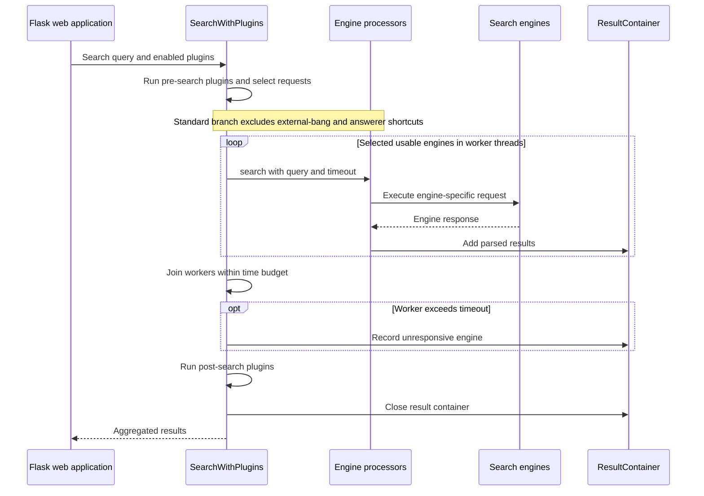
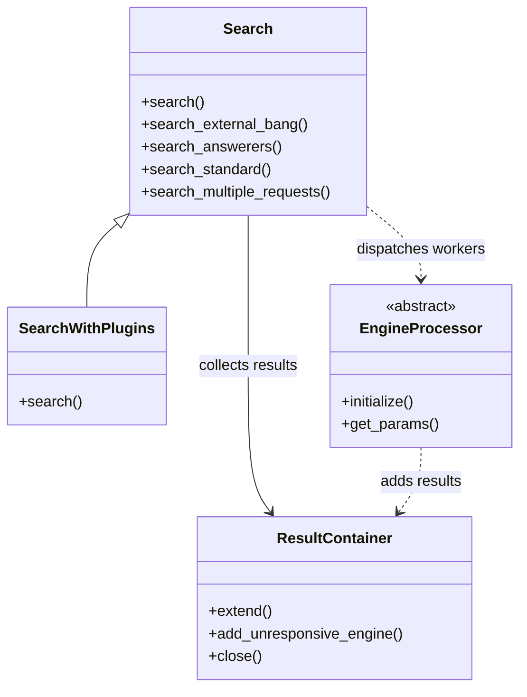

# SearXNG — Personal Fork

A fork of SearXNG, the open-source metasearch engine that combines results from multiple search services.

**Technology:** Python · Flask · Search engine integrations · Browser frontend

**Upstream:** [searxng/searxng](https://github.com/searxng/searxng). This repository is a fork; original authorship remains with the upstream project and its contributors.

## Features

- Query configured search engines through a unified interface.
- Provide search categories, preferences, and optional output formats.
- Offer a configurable self-hosted search service.

## Repository guide

| Path | Purpose |
|---|---|
| [README.rst](README.rst) | Upstream project introduction and links. |
| [searx](searx) | Python application and search engine implementations. |
| [client/simple](client/simple) | Browser frontend. |
| [docs](docs) | Administration and development documentation. |
| [container](container) | Container configuration. |
| [CONTRIBUTING.rst](CONTRIBUTING.rst) | Upstream contribution workflow. |
| [AI_POLICY.rst](AI_POLICY.rst) | Upstream AI contribution policy. |
| [LICENSE](LICENSE) | License terms. |

## Requirements and current limitations

Configure engines, networking, rate limiting, and instance settings for your deployment. This fork's README does not establish that an instance is live or that upstream behavior has been independently tested here.

This fork-specific `README.md` was rewritten with ChatGPT Codex assistance. Read `AI_POLICY.rst` before preparing any contribution to the upstream project.

## UML diagrams

### Main workflow

This sequence summarizes the standard federated-search branch. Engine processors run concurrently, and timeouts are tracked in the shared result container.



### Search class relationships

These source classes show plugin-aware search extending the base search workflow and using the shared result container.



## Getting started

```bash
git clone https://github.com/IbrahimAbdelsattar/searxng.git
cd searxng
```

Use the upstream instructions referenced by the committed `README.rst`:

- [Installation guide](https://docs.searxng.org/admin/installation.html)
- [Configuration guide](https://docs.searxng.org/admin/settings/index.html)
- [Development quickstart](https://docs.searxng.org/dev/quickstart.html)

The committed development guidance uses `make install` to prepare an environment and `make run` to start the application. Review the appropriate guide before choosing source or container deployment.

## License

AGPL-3.0-or-later. See [LICENSE](LICENSE) for the license terms and retain upstream copyright notices.
